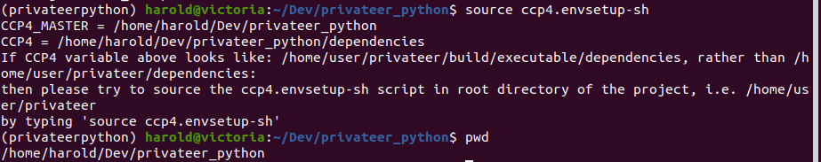
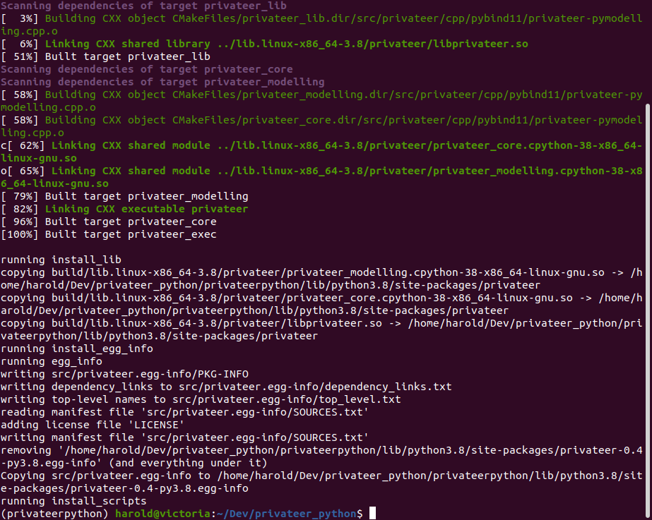
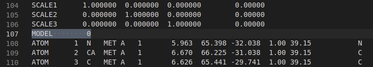

[](https://zenodo.org/badge/latestdoi/380387978)


<!-- PROJECT LOGO -->
<br />
<p align="center">
  <a href="https://github.com/GABRAH/project_alliance/tree/NatureCommunicationsDemo">
    
  </a>

  <h3 align="center">The case for post-predictional modifications in the AlphaFold Protein Structure Database</h3>

  <p align="center">
    Supplementary Data
    <br />
    <a href="https://github.com/glycojones/privateer/issues">Report Bug</a>
    ·
    <a href="https://github.com/glycojones/privateer/issues">Request Feature</a>
  </p>
</p>


<!-- TABLE OF CONTENTS -->
<details open="open">
  <summary><h2 style="display: inline-block">Table of Contents</h2></summary>
  <ol>
    <li>
      <a href="#about-the-grafting-script">About The Grafting Script</a>
    </li>
    <li>
      <a href="#getting-started">Getting Started</a>
      <ul>
        <li><a href="#prerequisites">Prerequisites</a></li>
        <li><a href="#installation-of-privateer">Installation Of Privateer</a></li>
        <li><a href="#setup-of-the-alphafolddb-glycan-grafting-demo-script">Demo Script Setup</a></li>
      </ul>
    </li>
    <li><a href="#usage">Usage</a></li>
    <li><a href="#roadmap">Roadmap</a></li>
    <li><a href="#license">License</a></li>
    <li><a href="#acknowledgements">Acknowledgements</a></li>
  </ol>
</details>


## About The Grafting Script

The grafting capabilities showcased here are currently a prototype and are expected to be significantly improved upon in the future as part of Privateer software. Therefore, feedback is most welcome.

The demo [grafter.py](privateer_grafting_demo/grafter.py) script is a user-friendly rendition to get Privateer to graft N-glycans onto AlphaFoldDB models with a few command line arguments.

In order to run this script, a **development version** of [Privateer](https://github.com/glycojones/privateer/tree/privateerpython) software must be obtained that is not yet officially released through [CCP4](https://www.ccp4.ac.uk/) and [CCP-EM](https://www.ccpem.ac.uk/).

**Supported operating systems by the [development version of Privateer](https://github.com/glycojones/privateer/tree/privateerpython):**
* **Linux**(tested on Ubuntu Linux 20.04)
* **MacOS**(tested on MacOS "Catalina" 10.15.5)

**Currently unsupported operating systems by the [development version of Privateer](https://github.com/glycojones/privateer/tree/privateerpython):**
* **Windows**

## Getting Started

To get a local copy up and running follow the steps below:

### Prerequisites

Assuming a fresh installation of **Ubuntu Linux 20.04**, the following system packages need to be installed via:
```sh
sudo apt-get install cmake
sudo apt-get install bzr
sudo apt-get install virtualenv
sudo apt-get install gfortran
sudo apt-get install m4
```

On MacOS, this can be achieved via [Homebrew](https://brew.sh/) package manager and running the following commands afterwards:
```sh
brew install wget
brew install cmake
brew install bzr
brew install virtualenv
brew install gfortran
brew install m4
```

After the required system packages are installed, **[development version of Privateer](https://github.com/glycojones/privateer/tree/privateerpython)** needs to be compiled and built from scratch. For the grafting demo of AlphaFoldDB models, the installation procedure is composed of 2 steps.

### **Installation of Privateer**

1. Clone Privateer repo into *privateer_python* directory:
   ```sh
   git clone https://github.com/glycojones/privateer.git privateer_python
   ```
2. Change directory to *privateer_python*:
   ```sh
   cd privateer_python
   ```
3. Switch branch to [privateerpython](https://github.com/glycojones/privateer/tree/privateerpython) to obtain the latest developments of Privateer software:
   ```sh
   git checkout privateerpython
   ```
4. Get Privateer dependencies that are hosted on GitHub([gemmi](https://github.com/project-gemmi/gemmi), [nlohmann::json](https://github.com/nlohmann/json), [pybind11](https://github.com/pybind/pybind11), [pybind11_json](https://github.com/pybind/pybind11_json)):
   ```sh
   git submodule update --init --recursive
   ```
5. Create a virtualenv for Python3 interpreter that will contain Privateer's [pybind11](https://github.com/pybind/pybind11) bindings for **C++11 backend**:
   ```sh
   virtualenv privateerpython
   ```
6. Source [CCP4](https://www.ccp4.ac.uk/) environment variables that are used by Privateer's [CCP4](https://www.ccp4.ac.uk/) dependencies:
   ```sh
   source ccp4.envsetup-sh
   ```
    **CAUTION: THIS STEP HAS TO BE REPEATED EVERY TIME A NEW TERMINAL TAB/WINDOW IS OPENED**<br/>
    Secondary caution: The output of this step may appear error-like. This is normal behaviour, as shown in the following picture:
    <p align="left">
    </p>
7. Source Python3 interpreter from virtualenv that contains [pybind11](https://github.com/pybind/pybind11) bindings to Privateer's **C++11 backend**:
   ```sh
   source privateerpython/bin/activate
   ```
    **CAUTION: THIS STEP HAS TO BE REPEATED EVERY TIME A NEW TERMINAL TAB/WINDOW IS OPENED**
8. Install necessary Python modules through **pip3** to local **privateerpython** interpreter
   ```sh
   pip install -r requirements.txt
   ```
9. Compile/build development version of Privateer along with its dependencies:
   ```sh
   python setup.py install
   ```
    Successful installation of Privateer and its dependencies in the Terminal should appear in the following way:
    <p align="left">
    </p>

### **Setup of the AlphaFoldDB glycan grafting demo script**

1. In *privateer_python* directory from **substep 2** of previous installation step, clone [project_alliane](https://github.com/GABRAH/project_alliance.git) GitHub repository:
   ```sh
   git clone https://github.com/GABRAH/project_alliance.git grafting_demo
   ```
2. Change directory to *grafting_demo*:
   ```sh
   cd grafting_demo
   ```
3. Change git branch to **[NatureCommunicationsDemo](https://github.com/GABRAH/project_alliance/tree/NatureCommunicationsDemo)**:
   ```sh
   git checkout NatureCommunicationsDemo
   ```

**After following these steps, the installation should be complete!**


<!-- USAGE EXAMPLES -->
## Usage

### **1.) After the installation is complete, the following steps show how to prepare a fresh Terminal session to successfully run [grafter.py](privateer_grafting_demo/grafter.py) script.**
1. Change directory to *privateer_python*:
   ```sh
   cd privateer_python
   ```
2. Source [CCP4](https://www.ccp4.ac.uk/) environment variables that are used by Privateer's [CCP4](https://www.ccp4.ac.uk/) dependencies:
   ```sh
   source ccp4.envsetup-sh
   ```
3. Source Python3 interpreter from virtualenv that contains [pybind11](https://github.com/pybind/pybind11) bindings to Privateer's **C++11 backend**:
   ```sh
   source privateerpython/bin/activate
   ```
4. Change directory to *grafting_demo*:
   ```sh
   cd grafting_demo
   ```
5. Change directory to *privateer_grafting_demo*:
   ```sh
   cd privateer_grafting_demo
   ```

### **2.) Running [grafter.py](privateer_grafting_demo/grafter.py) script.**

1. Get all available command line arguments/flags:
   ```sh
   python grafter.py -h
   ```
2. Most convenient use of the script:
   ```sh
   python grafter.py -import_uniprotIDs_from_file uniprotIDinputs.txt
   ```
   The **"-import_uniprotIDs_from_file"** flag will import a text file containing UniProtIDs of AlphaFoldDB models that are to be N-Glycosylated. The script will make online API queries to appropriate servers to 1) **retrieve and locally save the AlphaFoldDB model** and 2) **query UniProt database to determine which amino acids to N-glycosylate**.</br>
   An [example file](privateer_grafting_demo/uniprotIDinputs.txt) is provided and users are encouraged to modify it with appropriate UniProt IDs that can be N-Glycosylated. The script is able to parse **both** _comma seperated values_ and _new line seperated values_
3. It is also possible to run the script in the offline mode(assuming that an input structure can be locally sourced):
   ```sh
   python grafter.py -local_receiver_path input/receiving_model/P29016.pdb
   ```
   If **"-uniprotID"** flag with appropriate **UniProt ID** is not provided alongside with **"-local_receiver_path"** flag, then the script will glycosylate input structure according to the following N-Glycosylation consensus sequence: **Asn-Xaa-Ser/Thr**(where **Xaa** is not **Pro**) or **Asn-X-Cys**(where **X** denotes any amino acid).</br>
   **WARNING: If using this method, please make sure that the following highlighted line in the image is removed:**
    <p align="left">
    If the specific line is not removed, this will cause Privateer's MMDB dependency to segfault. Online methods of the script automatically deletes the line shown on the picture above.</p>
4. Currently, by default all input AlphaFoldDB models are N-glycosylated with [Man5](privateer_grafting_demo/input/glycanblocks/man5/cluster1.pdb) glycan. In order to change the donor glycan, this can be done through the following method:
   ```sh
   python grafter.py -import_uniprotIDs_from_file uniprotIDinputs.txt -donor_path privateer_grafting_demo/input/glycanblocks/man9/cluster3.pdb
   ```
5. Simply running the script without any optional flags:
   ```sh
   python grafter.py
   ```
    Will run the script with the following default flags: 
    _-uniprotID P29016_; _-donor_path privateer_grafting_demo/input/glycanblocks/man5/cluster1.pdb_; _-download_path privateer_grafting_demo/input/receiving_model_; _-output_path privateer_grafting_demo/output_. 
    
<!-- ROADMAP -->
## Roadmap

See the [open issues](https://github.com/glycojones/privateer/issues) for a list of proposed features (and known issues).


<!-- LICENSE -->
## License

Distributed under the MIT License. See `LICENSE` for more information.


Project Link: [https://github.com/glycojones/privateer](https://github.com/glycojones/privateer)


<!-- ACKNOWLEDGEMENTS -->
## Acknowledgements

HB is funded by The Royal Society grant RGF/R1/181006. JA is the Royal Society Olga Kennard Research Fellow award ref. UF160039. CAF is funded by the Irish Research Council (IRC) Government of Ireland Postgraduate Scholarship Programme.
Data and methods are available at https://doi.org/10.5281/zenodo.5290625
